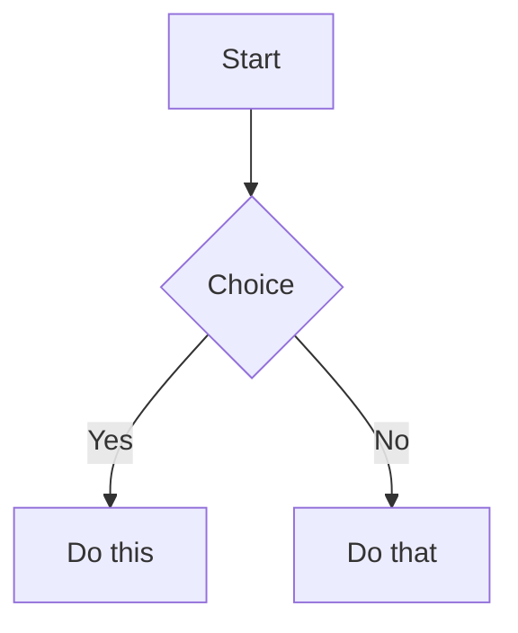
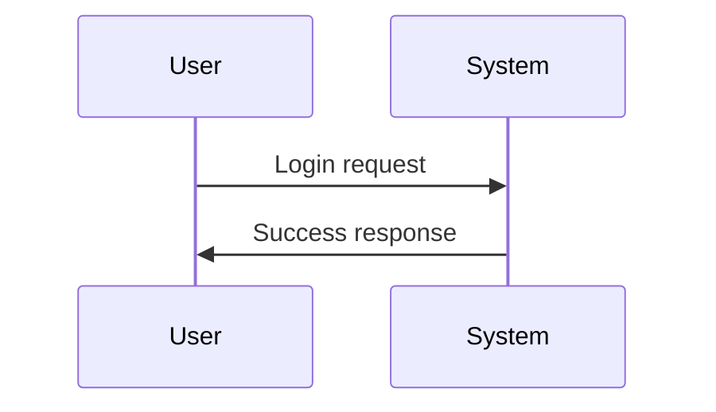

<!-- Tables -->

# Tables: 
|nam|age|
|---|---|
| a | 1 |
| b | 2 | 
| c | 3 |

---

<!-- Task Lists -->
# Task Lists: 
- [x] Completed task
- [ ] Pending task

---

# Use of this is \ (IMPORTANT)
- We use (\) at the start of any special operations like either for  * *, # or etc.., like this. And this implementation will differ from operations. We use this mainly to cancel the implementation of those particular operations. <br>
**Example:** 

> #### # Hi - here this will return the text in h1 tag based 
>
> \ # Hi - this won't retrurn the text in h1 tag based 

- ## Note: 
  - while adding \ (backslash) before the any operation there should not be any space between them.

---
<br> 
[^1]: This is the explanation for the footnote.

This is a sentence with a footnote.[^1]

[^1]: This is the footnote content.

<br> 

---
<br> 
<details>
<summary>Click to expand</summary>

Your hidden content here.
</details>
<br> 

---
# Mermaid diagrams.





```yaml
---
title: Example
description: Sample YAML block
version: 1.0
```

---