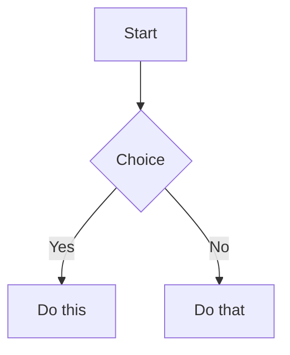
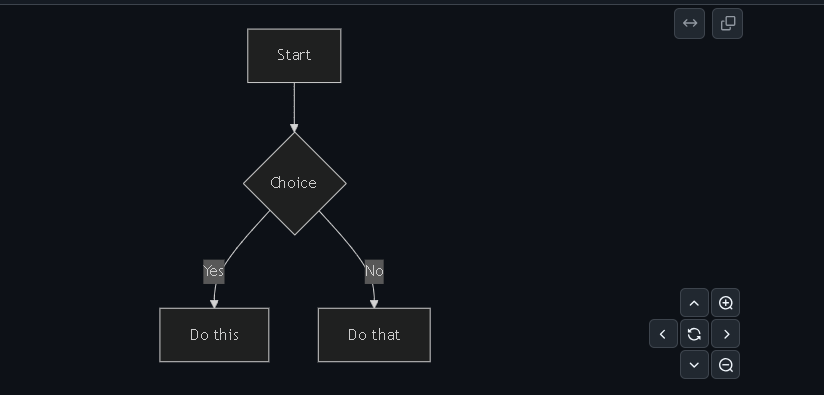
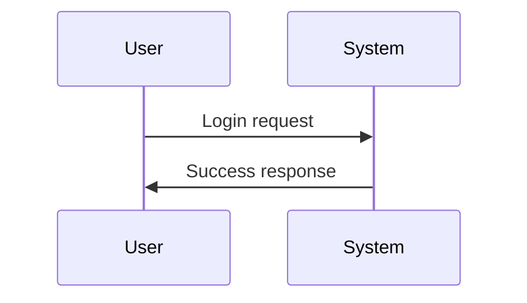
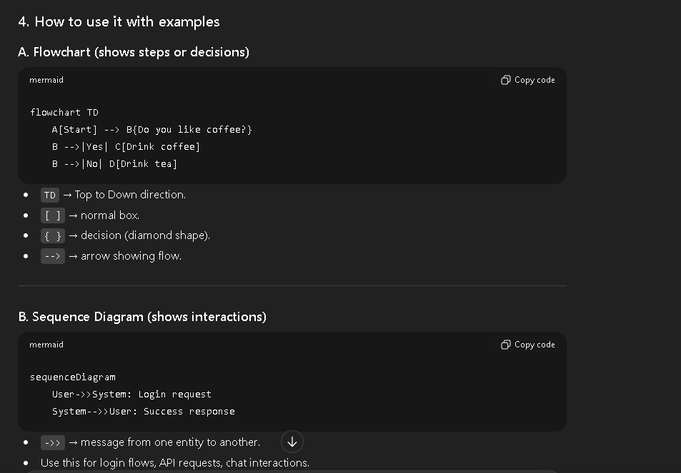
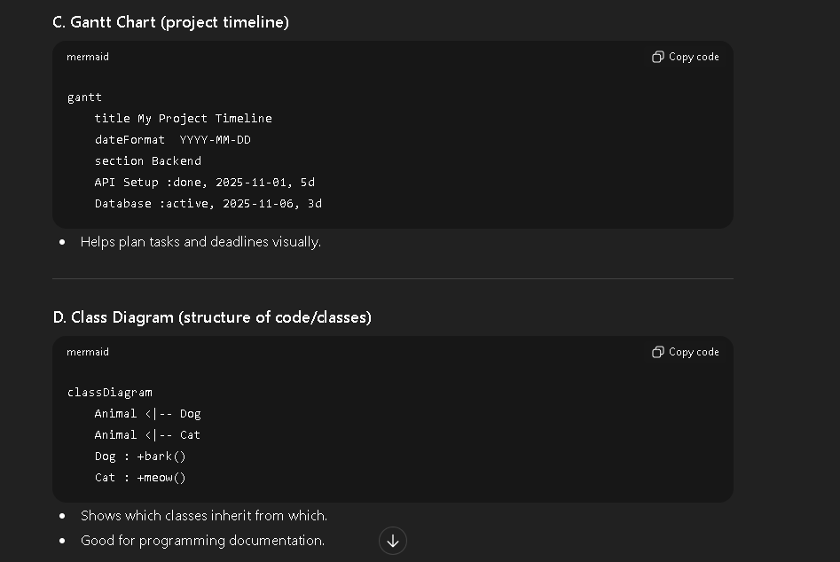
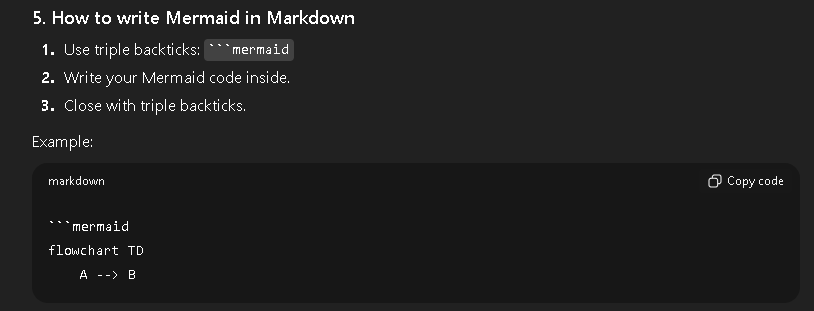

This is a sentence with a footnote.[^1]
<!-- Tables -->

# Tables: 
|nam|age|
|---|---|
| a | 1 |
| b | 2 | 
| c | 3 |

---

<!-- Task Lists -->
# Task Lists: 
- [x] Completed task
- [ ] Pending task

---

# Use of this is \ (IMPORTANT)
- We use (\) at the start of any special operations like either for  * *, # or etc.., like this. And this implementation will differ from operations. We use this mainly to cancel the implementation of those particular operations.  
**Example:** 

> #### # Hi - here this will return the text in h1 tag based 
>
> \ # Hi - this won't retrurn the text in h1 tag based 

- ## Note: 
  - while adding \ (backslash) before the any operation there should not be any space between them.

---
[^1]: Go To Top😉

---
  

Click to expand

Your hidden content here.

  

---
# Mermaid diagrams.

## 1. Flowchart Diagram Overview:  

<!-- # Image Preview: 
 -->
> - **The use of this is MERMAID diagrams is we can adjust the size of this particular flowcharts or diagrams or anything and we ever user clicks on this we can see that particular thing gets to shown as preview.**  

## 2. Sequence Diagram Overview: 

---

# 1. What is MERMAID ? 
- Mermaid is a tool that lets you draw diagrams using just text inside your Markdown files.

- You don’t need to open Photoshop, Draw.io, or PowerPoint. Just write a few lines of code, and it automatically creates the diagram.

- Think of it like coding your diagram instead of drawing it.
---

# 2. Why do we use it?
- Visualize ideas: Sometimes text alone is confusing. Diagrams help explain processes, workflows, or system designs.

- Easy to maintain: If a process changes, you just update the text, not redraw the whole diagram.

- Works in Markdown: Tools like GitHub, GitLab, Notion, Obsidian support Mermaid. So your diagrams show directly in your README.md or notes.

# 3. When to use it?

- Use Mermaid when you want to:

- Show steps of a process → flowcharts.

- Show how users or systems interact → sequence diagrams.

- Show project timelines → Gantt charts.

- Show class structures in programming → class diagrams.

- Basically any visual explanation in text-based docs.
---

---

---

✅ **In short:**  
Mermaid = **text → diagrams**.  
Use it in Markdown when you want **visual explanations** of your project, processes, or code.

---